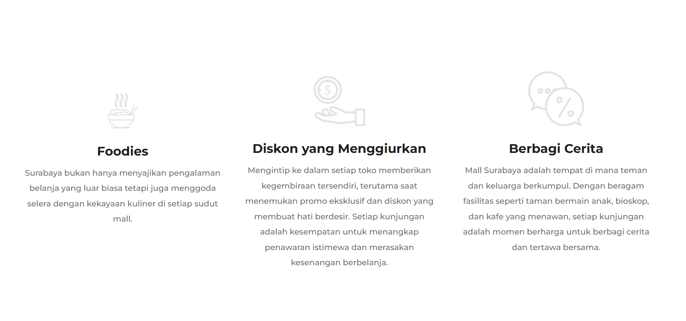
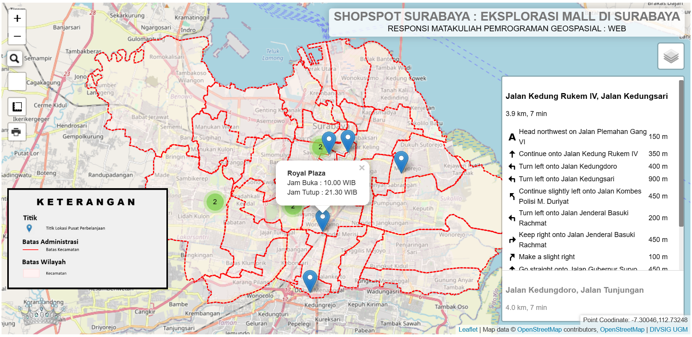

# ShopSpot Surabaya : Eksplorasi Pusat Perbelanjaan
___

## Deskripsi Produk

WebGIS ShopSpot Surabaya merupakan sebuah platform berbasis web yang dirancang untuk memberikan pengalaman eksplorasi yang unik di pusat perbelanjaan Surabaya. Produk ini menggabungkan teknologi Geographic Information System (GIS) dengan informasi real-time untuk memandu pengguna dalam menemukan, menjelajahi, dan mendapatkan informasi tentang pusat perbelanjaan di Surabaya.

## Komponen Pembangun Produk

- **HTML:** Menyediakan kerangka dasar untuk membangun konten dan struktur halaman web.
- **CSS:** Mengontrol tampilan elemen HTML serta tata letak dan desain halaman web.
- **Bootstrap Library:** Framework CSS untuk mempercepat pengembangan antarmuka dengan menyediakan kumpulan komponen dan gaya.
- **Leaflet.js Library:** Library JavaScript untuk menangani peta interaktif.
- **Geoserver:** Sebagai server GIS untuk menyediakan dan mengelola data geospasial.
- **MySQL:** Database untuk data titik perbelanjaan Kota Surabaya.
- **XAMPP:** Software opensource yang menyediakan lingkungan pengembangan lokal untuk membuat dan mengelola situs web dinamis.
- **Integrasi Media Sosial:** Memberikan opsi untuk berbagi pengalaman belanja melalui platform media sosial.

## Sumber Data

- Data titik pusat perbelanjaan diambil melalui Google Earth dan Google Maps.
- Data shapefile Kota Surabaya.
- Data rating, deskripsi, dan lainnya mengenai titik pusat perbelanjaan diambil melalui Google Maps.
- Integrasi media sosial (Youtube, Instagram, dan Twitter)

## Tangkapan Layar Komponen Penting Produk

1. **Landing Page:**
   
   
   
   

2. **WEBGIS Dengan Elemen Database:**
   

